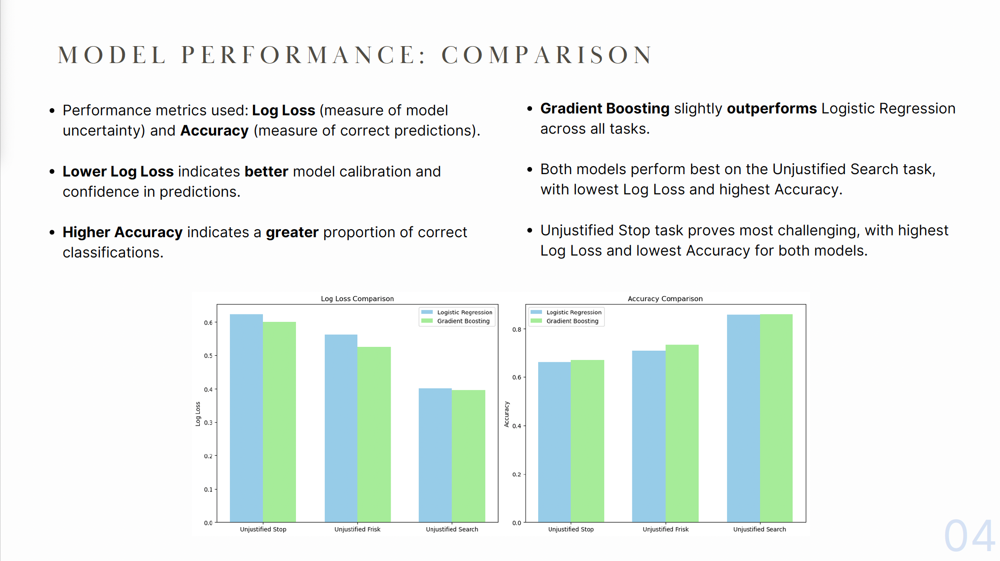

# Unmasking Bias: Leveraging Data Analytics to Drive Equity in NYC Criminal Justice System

## Introduction

This project tackles the challenge of quantifying police bias and understanding systemic disparities in law enforcement practices. By analyzing patterns of unjustified police actions, it develops a predictive model to forecast the likelihood of bias against individuals based on their demographic and contextual background, such as race, gender, neighborhood, and time of day.

### The Challenge of Quantifying Bias

The primary aim is to create a tool for the NYPD to identify areas for improvement in their policing practices.
Bias in law enforcement is often intangible and difficult to measure.
Traditional metrics like arrest rates fail to capture the nuanced decision-making processes that lead to biased actions. This project introduces robust indicators of bias, such as:

- **Unjustified Stop Rates**: Rates of instances where an individual was suspected of a crime and stopped, without valid cause for arrest in the end.
- **Unjustified Frisks and Searches**: Rates of instances where an individual was suspected of a crime and stopped, frisked and or searched without being arrested. These actions reflect unwarranted suspicion without justified outcomes.

These indicators uncover patterns of disproportionate scrutiny across racial, socioeconomic, and demographic groups, ensuring fair comparisons even when crime rates differ.

---

## Datasets

### 1. Stop, Question, and Frisk Data
**Source**: [NYPD Stop-and-Frisk Records (2022)](https://www.nyc.gov/site/nypd/stats/reports-analysis/stopfrisk.page)  
This dataset includes details on over NYPD stop-and-frisk incidents:
- **Demographics**: Age, race, gender, height, and other identifiers.
- **Incident Details**: Location, time, duration, reason for the stop, and outcomes (arrests, frisks, searches).

### 2. Neighborhood Financial Health Data
**Source**: [NYC DCWP (2022)](https://data.cityofnewyork.us/Business/Neighborhood-Financial-Health-Digital-Mapping-and-/r3dx-pew9/about_data)  
This dataset provides insights into financial health across NYC neighborhoods:
- **Demographics**: Median income, poverty rates, racial composition.

---

## Supervised Learning Models

- **Logistic Regression**: Competitive accuracy with interpretable coefficients.
- **Gradient Boosting**: Superior performance, especially for predicting unjustified frisks and searches.

---

## Results

### Some Exploratory Data Analysis results:

### Predictive Model Performance Summary:

### Feature Importance

